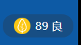

# 可以试着添加的功能：

1. 二次让用户确认是否删除历史记录
2. 添加一个常用列表

# 一、API使用

---

实时空气质量

|      参数      |       描述       |              |
| :------------: | :--------------: | :----------: |
|  `now.level`   | 空气质量指数等级 | 优：1、良：2 |
|   `now.aqi`    |   空气质量指数   |      89      |
| `now.category` | 空气质量指数级别 |      良      |

---

